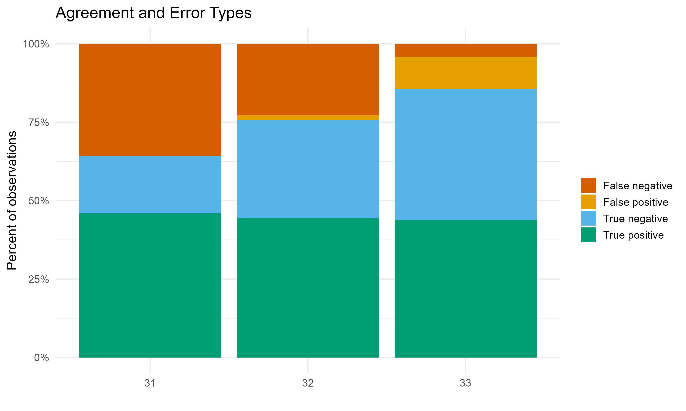
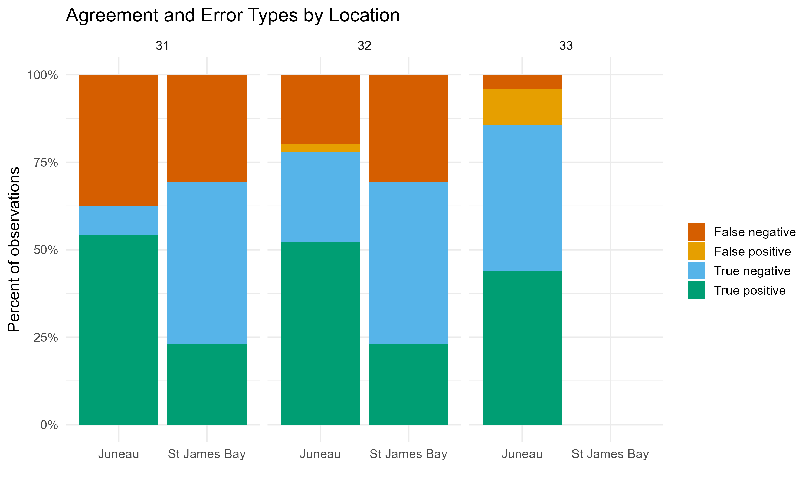
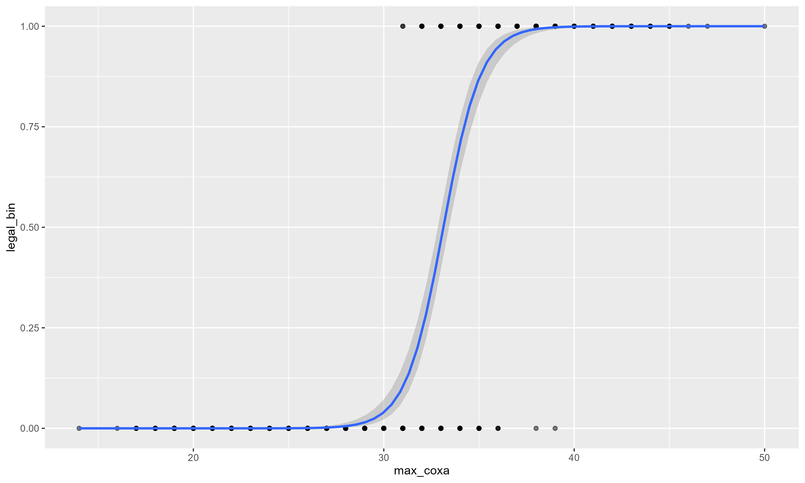

```{r setup, include=FALSE}
knitr::opts_chunk$set(echo = FALSE)

library(knitr)
library(tidyverse)
library(kableExtra)
```


# Overview
In addition to the base data for the Crab Allometry Project (where we measured coxa width, carapace width, and carapace length), Chris took some test measurements with tools set at 31mm, 32mm, and 33mm. By measuring the coxa width, can we correctly identify legal crab?

# Methods
This test was conducted twice, with notably different methodology and datasheet structures. Chris measured the second walking leg at the coxa legal threshold, and if that was too small (failed the legality test) he measured all other legs to make sure none of them were larger than the coxa legal threshold currently being tested. Test 1 was conducted in June 2025 in St. James Bay. Coxa width thresholds of 31mm and 32mm were tested and the carapace width was recorded. Test 1 measured 74 crab, 52 at the test coxa width of 31mm and 22 crab at the test coxa width of 32mm. A male crab of width 178mm (7 inches) or greater is a legal crab. Test 2 was conducted in July 2025 in the Juneau Area. Coxa width thresholds of 31mm, 32mm, and 33mm were tested, and the carapace length was recorded, but not the carapace width. In Test 2, the stick.legal column indicates legality, that the crab is 178mm or wider. In Test 2, 146 crab were measured, all at the 31mm, 32mm, and 33mm coxa thresholds. Some data wrangling was required in order to get these two datasets together for graphing.

Some notable column metadata:
- Stick.legal indicates if the crab is legal width, as measured by the 7in (178mm) width stick.
- Coxa.legal indicates if the crab is legal or not as determined by the coxa width. This is the test measurement.

I was primarily interested in false positives (type 1 error; crab is actually legal size but coxa width says it is not). It would not be great if the troopers erroneously cited someone for harvesting a legal crab, which could happen if we set the coxa threshold too large. I also calculated true positives, true negatives, and false negatives (type 2 error).

## Data wrangling
I combined the two coxa test measurement datasets into one master dataset per test measurement (31mm, 32mm, 33mm) with the following columns: Location, Stick.legal, Coxa.legal. 

## Binomial model
As an afterthought, I threw the existing data (from the 2025 June survey and the earlier 2017 data, the stuff the Spencer already worked with) into a binomial model with legality (0 or 1) as the response variable and max coxa width as the explanatory variable.

## Other
Other analysis option - Receiver Operating Characteristic (ROC) curve- not yet explored.


# Results and Discussion

## Sensitivity and specificity of the coxa test datasets
A coxa test width of 31mm was the most conservative test width, getting right 64.2% of measured crab, with no false positives (false positive here indicating an actually legal crab that the coxa identifies as sublegal; Figure 1, Table 1). Coxa test width 32mm had one false positive and correctly identified legal size or lack thereof in 75.5% of the crab (Figure 2, Table 2). Coxa test width of 33mm was the most accurate at 85.6% correct identification of legal crab, but 10.3% of the missed calls were false positives, the least desirable missed call (when the crab is actually legal but the coxa width informs that it is not; Figure 3, Table 3). So choosing a threshold of 31mm would be on the conservative size, calling some crab legal that are too small, but not erroneously punishing anyone who harvested a legal size crab. Choosing a threshold of 32mm would be a more accurate threshold, with a small but notable risk of false positives (1.52% false positive rate with 32mm threshold in this study). I'd advise against 33mm as the coxa width test measurement; a false positive rate of 10% is too high. Either 31mm or 32mm could be feasible, but I think we'll want more test measurement data.

## Binomial analysis - from the 2017 and June 2025 data collection events
This analysis implies that we need to be more conservative. From this analysis, coxa widths of 31, 32, and 33 have rates of 0.103, 0.241, and 0.467 chance of being attached to a legal size crab, respectively (Figure 3, Table 4). Coxa width thresholds of 29 and 30 look better, with respective rates of legality of 0.0148 and 0.0398 (Figure 3, Table 4). The binomial analysis indicates that we want a lower coxa threshold in order to avoid false positives (it was a legal crab and the trooper erroneously cites the fisherman based on the coxa width). Note that I did use the maximum coxa size for this analysis, so if there's a better angle to look at this data from please let me know.


# Tables


```{r Table 1}
d <- read.csv("../results/coxa test 31.csv")

kable(d, caption = "Test coxa measurement of 31mm")
```

```{r Table 2}
d <- read.csv("../results/coxa test 32.csv")

kable(d, caption = "Test coxa measurement of 32mm")
```


```{r Table 3}
d <- read.csv("../results/coxa test 33.csv")

kable(d, caption = "Test coxa measurement of 33mm")
```


```{r Table 4}
d <- read.csv("../results/binom_df.csv")

kable(d, caption = "Predicted rates of legality at the given coxa width.")
```


# Figures


```{r fig1}



```

```{r fig2}


```
```{r fig3}

```


